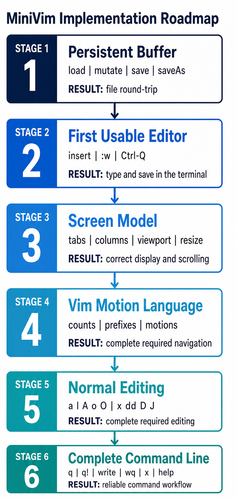

# MiniVim

> 一个面向大一学生的 C++17 课程项目：从零实现一个可以在终端中运行的、具有基本 Vim 操作方式的文本编辑器。

如果你只是想学习如何使用 Vim，请阅读[Vim 入门笔记](./IntroForVim.md)。

## 学习目标

完成项目后，你应该能够：
* 熟悉 C++ 的基本**语法**与STL,如std::filesystem, std::optional, std::vector；
* 掌握基本的**模块化设计**思想，将一个复杂问题拆分成若干职责明确、相互协作的模块；
* 理解**封装**的意义，通过类的公开接口隐藏内部状态和实现细节；
* 熟悉 C++ 的基本面向对象程序设计方法；
* 建立基本的**单元测试**意识：将容易独立验证的逻辑从交互式程序中分离出来，并通过测试检查模块行为和边界情况；
* 对Vim之类的文本编辑器的底层设计实现有新的了解


## 环境与快速开始

### 环境要求

VsCode(需包含基本C++插件) + WSL(需包含build-essential + gdb)

如果你wsl里面有没装的:

```shell
#安装
sudo apt install build-essential gdb
#检查
g++ --version
make --version
gdb --version
```


### 2.2 构建、测试与运行

```sh
make
make test
./MiniVim [file]
```

`make` 会生成根目录下的 `MiniVim` 可执行文件；`make test` 会构建并运行当前的核心测试。若要删除构建产物，可以运行：

```sh
make clean
```

程序最多接收一个文件路径：

```sh
./MiniVim README.md   # 打开已有文件
./MiniVim             # 创建一个显示为 [No Name] 的空缓冲区
```

当前语义下，命令行参数必须指向一个可以读取的已有文件。要创建新文件，请先无参数启动，再使用 `:w filename` 为 `[No Name]` 缓冲区命名并保存。

## 课程代码介绍

### Starter code

| 内容 | Starter code 中的状态 | 学生应做什么 |
| --- | --- | --- |
| `src/Terminal.hpp`, `src/Terminal.cpp` | 提供完整实现 | 阅读接口并直接使用 |
| `src/Types.hpp`, `src/Key.hpp` | 提供公共数据类型与按键表示 | 理解这些类型在模块间承担的协议 |
| 其余模块的头文件 | 保留公共接口、必要的数据成员和接口注释 | 按接口完成对应实现；可以添加私有辅助函数 |
| 其余实现文件 | 不提供参考实现，只保留必要骨架 | 完成所有非终端功能 |
| `Makefile` 与测试框架 | 提供完整实现 | 用于持续构建和验证 |
学生需要完成的核心模块包括：

- `TextLayout`：缓冲区列与屏幕列之间的转换；
- `Buffer`：文件内容、文本修改、修改标记与保存；
- `Window`：光标、期望列与视口；
- `NormalCommandParser`：Normal 模式命令解析；
- `Renderer`：从状态生成一帧 ANSI 文本；
- `Editor`：事件循环、模式切换与动作执行；
- `main`：参数处理、对象创建与顶层错误处理。

### 接口约束

除课程明确标注可以修改的部分外，请遵守以下规则：

不修改已有的public接口,因为测试点会调用它们
可以添加私有数据成员和私有辅助函数；
不修改 `Terminal` 的实现，也不要让其他模块直接用 `read`、`write`、`tcsetattr` 等终端系统调用；
不要引入第三方库。项目只需要 C++17 标准库和 POSIX 系统接口。


## 待实现的basic功能

**具体的细节行为要求在代码对应的接口处注释, 这里只是对需要实现的功能的简单介绍**

### 模式

MiniVim 有三种模式：

- **Normal**：移动光标、执行编辑动作或进入其他模式；
- **Insert**：插入和删除文本；
- **Command-line**：输入保存、退出等以 `:` 开始的命令。

`Escape` 从 Insert 或 Command-line 返回 Normal。
`Ctrl-Q` 是紧急退出键，在任意模式下都应结束程序。

### Normal 模式移动

| 按键 | 行为 |
| --- | --- |
| `h`, `j`, `k`, `l` 或方向键 | 左、下、上、右移动 |
| `w`, `b`, `e` | 下一词首、上一词首、当前或下一词尾 |
| `0`, `^`, `$` | 行首、第一个非空白字符、行尾 |
| `gg`, `G` | 文件首行、文件末行 |
| `H`, `M`, `L` | 可见窗口的顶部、中部、底部 |
| `Ctrl-U`, `Ctrl-D` | 向上、向下移动半页 |
| `Ctrl-B`, `Ctrl-F`, Page Up, Page Down | 向上、向下移动一页 |

移动可以带数字前缀，例如 `12j`、`3w` 和 `3G`。没有显式数字时，重复次数由具体命令的默认语义决定。


### 编辑命令

| 按键 | 行为 |
| --- | --- |
| `i`, `a` | 在光标前、后进入 Insert 模式 |
| `I`, `A` | 在本行第一个非空白字符、行尾进入 Insert 模式 |
| `o`, `O` | 在当前行下方、上方插入空行并进入 Insert 模式 |
| `x` | 删除光标下的字符 |
| `dd` | 删除当前行 |
| `D` | 删除从光标到行尾的内容 |
| `J` | 将当前行与下一行连接，并处理连接处空白 |

`x`、`dd` 和 `J` 支持数字前缀，例如 `3x`、`2dd` 和 `3J`。一般形式的
operator-pending 命令（如 `dw`、`d$`）不属于必做功能。

Insert 模式需要额外支持：
Enter 将一行拆成两行；
Backspace 删除前一个字符，在行首时与上一行连接；
Delete 删除当前字符，在行尾时与下一行连接；
Escape 返回 Normal，并把光标恢复到合法的 Normal 模式位置。


### Command-line 模式

| 命令 | 行为 |
| --- | --- |
| `:w [file]`, `:write [file]` | 保存缓冲区；可选路径用于另存并更新缓冲区名称 |
| `:wq [file]` | 保存成功后退出 |
| `:x [file]` | 必要时保存，随后退出 |
| `:q`, `:quit` | 仅在没有未保存修改时退出 |
| `:q!`, `:quit!` | 丢弃未保存修改并退出 |
| `:help` | 在消息区域显示简短帮助 |

Command-line 模式还应支持 Backspace/Delete 删除命令字符、`Ctrl-U` 清空当前命令，以及 Escape 取消命令。


## Hint


### 一次按键如何流过系统


`Editor::processKey()` 是模式分发的唯一入口。只有 Normal 模式会先经过
`NormalCommandParser` 并产生 `EditorAction`；Insert 和 Command-line 模式分别由
Editor 中对应的 handler 直接处理。三条路径都在 Editor 中完成本次按键的语义；
如果程序继续运行，`Renderer` 再根据 `Buffer`、`Window` 和 `RenderState` 生成
下一帧，最后交给 `Terminal` 输出。


## 推荐实现顺序

不要按“先写完一个类，再写下一个类”的方式推进。那种顺序虽然看起来符合依赖关系，
却会让你直到项目末尾才能第一次编辑文件，也很难判断各模块的接口是否真的能够协作。

以下是我们推荐的实现顺序:先建立可靠的文本持久化，再尽快接通一个功能很少但可以真实
编辑和保存文件的版本；后续阶段逐步补全显示模型、Vim 命令语言和边界语义。每完成
一个阶段，都应该有可以运行或可以独立测试的结果。

<p align="center">
  
</p>


### Stage 1：实现可持久化的 Buffer

**涉及文件：** `src/Buffer.cpp`

编辑器首先需要一个可信的文本模型。这个阶段应完整实现 Buffer，而不依赖 Terminal、
Window 或 Renderer。Buffer 负责加载文件、拥有文本、执行修改并把结果写回磁盘；
光标和屏幕位置不属于这一阶段。

构造 Buffer 时，无路径表示一个名为 `[No Name]` 的空缓冲区；传入路径时应读取已有
文件，并记录原文件是否以换行符结尾。无论输入文件是否为空，`lines_` 都必须至少
包含一行。`line()` 只暴露 const 引用，所有写操作必须经过
`insertCharacter`、`eraseCharacter`、`splitLine`、`insertLine`、`eraseLines`、
`eraseToLineEnd` 和两个 join 接口，以便统一维护非空和 modified 语义。

保存不是后期附加功能，也属于文本模型本身。`save()` 使用 Buffer 已有路径；未命名
Buffer 调用它时应报告 `no file name`。`saveAs(path)` 应先成功写入文件，再更新
Buffer 的路径。只有写入完整成功后才能清除 modified；如果打开或写入目标失败，
原路径和 modified 状态都必须保持不变。

例如，下面这条往返链路必须在没有真实终端的测试中成立：

```text
空 Buffer
  -> 插入 "hello"
  -> splitLine(0, 5)
  -> 插入 "MiniVim"
  -> saveAs("note.txt")
  -> 重新构造 Buffer("note.txt")
  -> 得到两行完全相同的文本，且新 Buffer 未被标记为 modified
```

完成本阶段后,你应该可以通过buffer相关测试。
此时我们虽然还没有界面，但文件读取、修改和保存已经独立可用。

### Stage 2：接通第一个真正可用的编辑器

**涉及文件：** `src/TextLayout.hpp`、`src/Window.cpp`、`src/Renderer.cpp`、
`src/Command.cpp`、`src/Editor.cpp`、`src/main.cpp`

Stage 1 结束后，我们已经可以通过测试修改和保存文件，但还没有一个可以亲手操作的
编辑器。本阶段只接通最小的端到端链路，不实现 Motion、Operator 或完整的
Command-line 命令集。

Window 此时只需要支持 Normal/Insert 两种光标边界，以及设置光标后保证其可见；
Renderer 只需要绘制当前可见文本、模式、文件名、modified 标记和真实光标；
NormalCommandParser 只识别 `i` 和 `:`。Editor 接通事件循环，并实现下面这组最小行为：

| 输入 | 本阶段要求 |
| --- | --- |
| `i` | 从当前位置进入 Insert 模式 |
| 可打印 ASCII | 在 Insert 模式插入字符并向后移动光标 |
| Enter | 调用 `splitLine()`，把 Insert 光标移到新行开头 |
| Backspace | 删除前一个字符；位于行首时与上一行合并 |
| Escape | 从 Insert 或最小 Command-line 返回 Normal |
| `:w [file]` | 调用 Stage 1 的 `save()` 或 `saveAs()`，显示成功或失败消息 |
| `Ctrl-Q` | 从任意模式退出，让 Terminal 正常析构并恢复终端 |

这里保留 `:w` 是为了尽早验证 Buffer 的持久化接口，它是本阶段唯一需要实现的
Command-line 命令。不要在这里提前加入 `:q`、`:q!`、`:write`、`:wq`、`:x`、
`:help`、命令别名或未保存退出保护；这些统一留到 Stage 6。`h/j/k/l`、count 和其他
Motion 也全部留到 Stage 4。

为了让上面的链路能够运行，`main` 只需接受零个或一个文件参数并构造 Editor；
TextLayout、Window 和 Renderer 中与 Tab、控制字符、水平滚动和终端缩放有关的完整
规则留到 Stage 3。尚未支持的 Normal 按键应直接忽略，不能留下 pending 状态。

本阶段的验收是下面的工作流能够真实完成：

```text
./MiniVim
  -> 按 i
  -> 输入两行文本
  -> 按 Escape
  -> 执行 :w first.txt，文件成功创建
  -> 按 Ctrl-Q，程序正常退出
  -> ./MiniVim first.txt，屏幕显示刚才保存的内容
```


### Stage 3：补全屏幕坐标、视口与渲染

**涉及文件：** `src/TextLayout.hpp`、`src/Window.cpp`、`src/Renderer.cpp`

Stage 2 可以先假定简单文本和普通终端尺寸，但真实文件会包含 Tab、控制字符、长行和
长度不同的相邻行。本阶段要把“Buffer 中的位置”和“终端上的位置”严格区分开。

`TextLayout` 应统一定义显示规则：Tab 按固定 tab stop 展开；控制字符以 `^X` 形式
占用两个屏幕列；`screenColumn()` 把 buffer column 转换为 screen column，
`bufferColumn()` 完成反向映射，`expandForDisplay()` 必须使用同一套宽度规则。不能在
Renderer、Window 中各自复制一份 Tab 计算逻辑，否则光标和文字迟早会错位。

Window 在垂直移动时保存的是 `desiredScreenColumn_`。例如光标从一个包含 Tab 的长行
移动到短行，再移动到另一条长行时，应尽量回到原屏幕列，而不是停留在短行末尾。
`ensureCursorVisible()` 同时维护 `viewport.top` 和 `viewport.left`；`resize()` 应为
状态行和消息行预留空间，并且在只有一两行高的极小终端上仍然产生合法 Viewport。

Renderer 应先按 TextLayout 规则展开一行，再依据 `viewport.left` 按屏幕列裁剪。
它还需要补全文件末尾的 `~`、模式名、文件名、`[+]`、光标行列、消息、pending keys
以及 Command-line 光标位置。Renderer 仍然只返回一帧字符串，不能直接调用 Terminal。

完成本阶段后，Tab、长行、短行、控制字符和终端缩放都应被正确显示。这个阶段只保证
视图状态与屏幕输出一致，不增加新的 Motion。

### Stage 4：实现 Vim 的移动语义

**涉及文件：** `src/Command.cpp`、`src/Window.cpp`

到目前为止，Parser 只识别单键命令。本阶段要把它扩展成一个真正的小型状态机：
数字是 count，`g` 是可能尚未完成的 Motion 前缀，普通按键只有在命令完整时才生成
EditorAction。Parser 只描述“用户想做什么”，Window 才决定该动作在当前文本中的
目标位置。

必须正确区分 `0` 和 count：初始的 `0` 是 LineStart，而 `10j` 中的 `0` 属于数字。
`12j` 应在收到 `1`、`2` 时保持 pending，直到收到 `j` 才返回
`Move{Down, count = 12}`。`gg` 产生 FileStart；单独的 `g` 不产生动作；`g` 后跟
无效字符时必须清空前缀，使下一条命令从干净状态开始。Escape 同样取消所有 pending
输入。count 累积不能发生整数溢出。

Window 需要在这一阶段补全以下 motion：

| 类别 | 必做 motion | 关键语义 |
| --- | --- | --- |
| 基本 | `h`, `j`, `k`, `l` 与方向键 | 支持 count；水平移动不跨行，垂直移动保持期望屏幕列 |
| 单词 | `w`, `b`, `e` | 区分空白、字母数字/下划线和标点，并能跨行移动 |
| 行 | `0`, `^`, `$` | 分别到字节行首、首个非空白字符和 Normal 模式行尾 |
| 文件 | `gg`, `G` | 无 count 时到首/末行；带 count 时到指定行 |
| 窗口 | `H`, `M`, `L` | 目标由当前 Viewport 决定，而不是整个文件 |
| 翻页 | `Ctrl-U/D/B/F`, Page Up/Down | 步长来自可见文本行数，并在文件边界饱和 |

Parser 与 Window 应分别测试。例如 Parser 测试只检查输入序列产生的 EditorAction；
Window 测试直接传入 Motion，检查 Position 和 Viewport。不要只通过完整编辑器测试两者，
否则 `3w` 出错时无法判断是 count 丢失还是单词边界算法错误。

完成本阶段后，MiniVim 已经是一个Vim-like的Text Viewer了。

### Stage 5：补全 Normal 模式编辑动作

**涉及文件：** `src/Command.cpp`、`src/Editor.cpp`，并复用 Stage 1 的 Buffer 接口和
Stage 3 的 Window 规范化接口

本阶段不再向 Buffer 添加“带光标”的高层命令。Parser 把按键翻译成 EditorAction，
Editor 使用 Buffer 的基础修改接口改变文本，再显式要求 Window 把光标恢复到合法位置。
这样 `dd` 的文本语义和“删除后光标应该落在哪里”仍然属于不同模块。

Parser 在这里才加入 `d` 前缀：第一次收到 `d` 时保持 pending，第二次收到 `d` 时
产生 DeleteLine；Escape 或无效后续按键必须取消这个 Operator 状态。Stage 4 已经实现
的 count 应继续生效，因此 `2dd` 产生 count 为 2 的 DeleteLine。

Stage 2 的 Insert 模式只实现了最小输入能力。本阶段同时补上 Tab 插入和 Delete：
Delete 在行内删除当前字符，位于行尾时与下一行合并；两种操作都必须维持 Insert 光标
合法，并正确更新 modified。

先补全进入 Insert 的位置命令：`a` 在当前字符之后，`I` 在首个非空白字符，`A` 在
`line.size()`，`o/O` 插入下一行/上一行并把 Insert 光标放在新行第 0 列。Insert 模式
允许光标位于行尾后一格；Escape 回到 Normal 时必须重新使用 Normal 的列上界。

随后实现 `x`、`dd`、`D` 和 `J`：

- `3x` 最多删除当前行剩余的三个字符，超过行尾的部分不跨行；
- `2dd` 删除两行，删除到文件末尾时仍保留一个合法空 Buffer；
- `D` 删除当前列到行尾，在空行上是安全的 no-op；
- `J` 默认连接当前行和下一行，`3J` 表示最终连接三行；连接时移除下一行前导空白，
  并只在需要时添加一个分隔空格；最后一行上的 `J` 是 no-op。


完成本阶段后，README 中列出的所有必做 Normal 编辑命令都应能在 Stage 2 的可用主链路
中工作，并且能够保存、退出、重新打开后得到同样的文本。

### Stage 6：补全命令行与失败语义

**涉及文件：** `src/Editor.cpp`、`src/Buffer.cpp`

Stage 2 只为打通端到端链路实现了一个特殊的 `:w`。本阶段才完整实现 Command-line
模式：它需要维护独立的输入字符串、支持编辑当前命令、解析命令名与路径参数，并决定
保存失败或存在未保存修改时能否退出。

Command-line 输入必须支持可打印字符、Backspace、Delete、`Ctrl-U`、Escape 和 Enter。
Escape 取消本次命令，`Ctrl-U` 清空整行，Enter 去除首尾空白后执行。解析时，第一个
单词是命令名，其余非空内容整体作为可选文件路径；空命令直接返回 Normal。

需要实现的命令为：

| 命令 | 行为 |
| --- | --- |
| `:w [file]`, `:write [file]` | 保存当前 Buffer；带路径时调用 `saveAs()` |
| `:q`, `:quit` | 仅在 Buffer 未修改时退出 |
| `:q!`, `:quit!` | 忽略 modified 状态直接退出 |
| `:wq [file]` | 保存成功后退出；保存失败时继续运行 |
| `:x [file]` | 有修改或带路径时保存，再退出；无修改时直接退出 |
| `:help` | 在消息区域显示项目支持的命令 |

未知命令应显示 `Not an editor command` 消息并返回 Normal。命令处理代码不应重复文件
写入逻辑，而应统一调用 `saveBuffer()`；这个 helper 负责把 Buffer 抛出的异常转换成
用户可见消息，并用返回值告诉 `:wq` 和 `:x` 是否可以继续退出。

以下差异必须在实现和测试中体现：

| 场景 | 正确结果 |
| --- | --- |
| `[No Name]` 执行 `:w` | 报告缺少文件名，保持 modified，继续运行 |
| `[No Name]` 执行 `:w note.txt` | 写入成功后更新路径并清除 modified |
| 有修改时执行 `:q` | 拒绝退出并提示使用 `!` |
| 执行 `:wq` 但写入失败 | 显示错误，不能退出 |
| 未修改且无路径参数时执行 `:x` | 直接退出，不做无意义写入 |
| 执行 `:q!` | 不保存并立即退出 |
| `saveAs(newPath)` 写入失败 | 保留旧路径和 modified 状态 |

最后应重新跑通两条完整链路：新建 `[No Name]`、编辑、另存、退出、重新打开；以及打开
已有文件、修改、验证 `:q` 拒绝、执行 `:wq`、重新打开并比较内容。保存失败、非法启动
参数和未知命令也必须留下可读错误信息，并保证正常退出路径恢复终端设置。

至此我们完成了Basic的所有内容。

## 测试策略

当前仓库中的 `tests/CoreTests.cpp` 只覆盖了部分早期核心行为，后续还需要补充测试。


### 单元测试

优先测试不依赖 Terminal 的模块：

- Buffer：空文件、换行保留、每种修改、越界、保存成功与失败；
- TextLayout：普通字符、Tab、控制字符、双向列转换；
- Window：空行、首尾、短行、期望列、滚屏、超大 count、`w/b/e`；
- Parser：单键、count、前缀、Escape、无效序列、count 溢出；
- Renderer：极小屏幕、水平滚动、三种模式、modified 标记和 pending keys。


### 集成测试

Editor 与 Terminal 的完整交互需要伪终端（PTY）或人工测试。建议覆盖：

- 方向键和 Escape 序列能否被正确解码；
- `i -> 编辑 -> Escape -> :w -> :q` 的完整流程；
- 未保存修改是否阻止 `:q`；
- `[No Name]` 能否通过带路径的写命令保存；
- 程序正常退出和发生异常后，终端设置是否恢复；
- 调整终端尺寸后，视口和状态行是否重新布局。


## 调试建议

**(重要) 终端异常时先恢复** 如果进程被强制终止导致 shell 显示异常，可以在 shell 中运行 `reset` 或 `stty sane`。正常控制流应依靠 Terminal 的 RAII 自动恢复。

**检查失败现场** 在出现问题时可以沿着调用栈向上回溯找到具体报错函数,也可以检查test生成的文件。

**不要关闭编译器警告** 项目目前开了相对严格的类型检查,很多时候bug来自int和size_t的转换问题。

## 基本功能完成标准

- [ ] 通过所有的本地测试点
- [ ] 通过ACMOJ上的所有测试点

## 项目边界与可选扩展

可以选择你在平时使用vim的过程中觉得好用的几个指令来支持

## 常见问题

### 可以把所有逻辑写在 Editor 里吗？

不可以。Editor 应负责协调，而不是拥有所有算法。文本修改属于 Buffer，光标与滚屏属于 Window，Normal 命令的部分输入状态属于 Parser，帧的生成属于 Renderer。

### 为什么不能直接修改头文件接口？

公共接口是模块之间以及课程测试与学生实现之间的契约。你可以添加私有辅助实现，但改变公共签名通常只是把错误转移到调用方，也会让测试无法链接。


### 为什么手动运行正常，仍然需要单元测试？

交互测试很难稳定覆盖空文件、超大 count、Tab 坐标和保存失败等边界。模块化设计的价值之一，就是让这些状态可以直接构造并重复验证。
