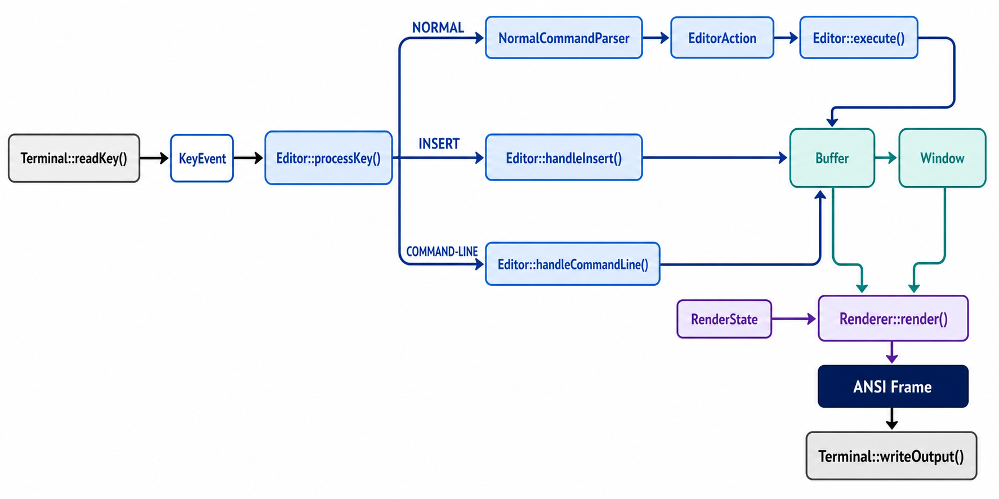

# MiniVim

> 一个面向大一学生的 C++17 课程项目: 从零实现一个可以在终端中运行的, 具有基本 Vim 操作方式的文本编辑器.

如果你只是想学习如何使用 Vim, 请阅读 [Vim 入门笔记](./IntroForVim.md).

## 学习目标

完成项目后, 你应该能够:

- 熟悉 C++ 的基本 **语法** 与 STL, 如 std::filesystem, std::optional, std::vector;
- 掌握基本的 **模块化设计** 思想, 将一个复杂问题拆分成若干职责明确, 相互协作的模块;
- 理解 **封装** 的意义, 通过类的公开接口隐藏内部状态和实现细节;
- 熟悉 C++ 的基本面向对象程序设计方法;
- 建立基本的 **单元测试** 意识: 将容易独立验证的逻辑从交互式程序中分离出来, 并通过测试检查模块行为和边界情况;
- 对 Vim 之类的文本编辑器的底层设计实现有新的了解

## 环境与快速开始

### 环境要求

VsCode (需包含基本 C++ 插件) + WSL (需包含 build-essential + gdb)

如果你 wsl 里面有没装的:

```sh
# 安装
sudo apt install build-essential gdb
# 检查
g++ --version
make --version
gdb --version
```

### 2.2 构建, 测试与运行

```sh
make
make test
./MiniVim [file]
```

`make` 会生成根目录下的 `MiniVim` 可执行文件; `make test` 会构建并运行当前的核心测试. 若要删除构建产物, 可以运行:

```sh
make clean
```

程序最多接收一个文件路径:

```sh
./MiniVim README.md   # 打开已有文件
./MiniVim             # 创建一个显示为 [No Name] 的空缓冲区
```

当前语义下, 命令行参数必须指向一个可以读取的已有文件. 要创建新文件, 请先无参数启动, 再使用 `:w filename` 为 `[No Name]`
缓冲区命名并保存..

## 课程代码介绍

### Starter code

| 内容                                   | Starter code 中的状态                  | 学生应做什么                             |
| -------------------------------------- | -------------------------------------- | ---------------------------------------- |
| `src/Terminal.hpp`, `src/Terminal.cpp` | 提供完整实现                           | 阅读接口并直接使用                       |
| `src/Types.hpp`, `src/Key.hpp`         | 提供公共数据类型与按键表示             | 理解这些类型在模块间承担的协议           |
| 其余模块的头文件                       | 保留公共接口, 必要的数据成员和接口注释 | 按接口完成对应实现; 可以添加私有辅助函数 |
| 其余实现文件                           | 不提供参考实现, 只保留必要骨架         | 完成所有非终端功能                       |
| `Makefile` 与测试框架                  | 提供完整实现                           | 用于持续构建和验证                       |

学生需要完成的核心模块包括:

- `TextLayout`: 缓冲区列与屏幕列之间的转换;
- `Buffer`: 文件内容, 文本修改, 修改标记与保存;
- `Window`: 光标, 期望列与视口;
- `NormalCommandParser`: Normal 模式命令解析;
- `Renderer`: 从状态生成一帧 ANSI 文本;
- `Editor`: 事件循环, 模式切换与动作执行;
- `main`: 参数处理, 对象创建与顶层错误处理.

### 接口约束

除课程明确标注可以修改的部分外, 请遵守以下规则:

不修改已有的 public 接口, 因为测试点会调用它们可以添加私有数据成员和私有辅助函数; 不修改 `Terminal`
的实现, 也不要让其他模块直接用 `read`, `write`, `tcsetattr`
等终端系统调用; 不要引入第三方库. 项目只需要 C++17 标准库和 POSIX 系统接口.

## 项目要求

### Basic

你必须实现 Basic 部分才能获得基础分数并继续完成 Advanced 部分与 Extra 部分.

MiniVim 的哲学是模态编辑, 高效的编辑操作依托各模式间的切换完成. 简而言之, 在 Basic 部分中, 你需要为 MiniVim 实现最基础的 3 种模式:

- **Normal**: 移动光标, 执行编辑动作或进入其他模式;
- **Insert**: 插入和删除文本;
- **Command-line**: 输入保存, 退出等以 `:` 开始的命令.

并为每个模式实现一些最基础的功能.

在 Basic 部分, 你可以简单地认为屏幕由两部分构成: 屏幕最下面两行的保留部分 (用于输入命令, 显示信息等)
, 以及上面其余的编辑部分, 即缓冲区.
Normal 模式与 Insert 模式主要操作缓冲区, 而 Command-line 模式则会将保留部分当成一块用于输入命令的命令缓冲区来操作.

`<C-q>`
在该项目中是未被绑定的保留键位. 你可以将其实现为紧急退出键, 按下后在任意模式下结束程序, 以便方便调试 Basic 部分. 我们不会对该键行为进行评测.

#### Normal 模式

在 Normal 模式中, 光标总会停留在某一个字符上 (对于空行, 则只能停留在不存在字符的位置) .

在 Basic 部分, 你需要为 Normal 模式实现以下的功能键:

- `h`

    光标向左移动一个字符; 如果光标在行首则不变.

- `l`

    光标向右移动一个字符; 如果光标在行末则不变.

- `j`

    光标向下移动一个字符; 如果光标在最后一行则不变. 若光标移动到的位置在这一行行末之后, 则向左移动到行末位置.

- `k`

    光标向上移动一个字符; 如果光标在第一行则不变. 若光标移动到的位置在这一行行末之后, 则向左移动到行末位置.

- `i`

    在光标所选字符之前进入 Insert 模式. 若光标处在空行, 则在该空行的唯一位置进入 Insert 模式.

- `a`

    在光标所选字符之后进入 Insert 模式. 若光标处在空行, 则在该空行的唯一位置进入 Insert 模式.

- `:`

    进入 Command-line 模式.

请注意对于空行, 该行的行末位置不存在实际字符; 而对于非空行, 该行的行末位置是最后一个字符的位置.

#### Insert 模式

在 Insert 模式中, 光标总会停留在某一个字符上, 或是停留在行末位置, 即行末字符之后的位置上 (你可以假想为那里存在一个换行符
`\n`; 事实上, Vim 就是这么实现的).

在 Basic 部分, 你需要为 Insert 模式实现以下的功能键:

- 所有 ASCII 码在 `0x20~0x7e` 之间的字符输入

    在光标所选字符之前插入输入的字符, 并将光标自然移动到下一个位置上.

- `<BS>`

    删除光标所选字符之前的字符, 并将光标自然移动到前一个位置上. 若光标处在行首 (或空行), 则拼接该行与上一行, 并将光标自然移动到上一行原行末位置上. 若光标处在文件首, 则无效果.

- `<CR>`

    在光标所选字符之前位置切分该行, 换行至下一行, 并将光标自然移动到下一行的行首.

- `<ESC>`

    进入 Normal 模式, 并将光标自然移动到前一个位置上. 若光标处在行首则不移动光标.

#### Command-line 模式

在 Command-line 模式中, 光标总会停留在窗口底部的命令输入部分, 总体操作逻辑类似于 Insert 模式中的一行, 并且此时行首必定以
`:` 开头.

进入到 Command-line 模式时, 初始输入的指令, 即命令缓冲区部分为空. 除了屏幕最下面一行, 其余部分显示内容应保持不变.

在 Basic 部分中, 你只需要考虑光标处在行末位置的情形. 也就是说, 任何停留在 Command-line 模式的操作最终都会将光标移动到行末位置.

在 Basic 部分, 你需要为 Command-line 模式实现以下的功能键:

- 所有 ASCII 码在 `0x20~0x7e` 之间的字符输入

    在光标所选字符之前 (在 Basic 部分中, 即行末) 插入输入的字符, 并将光标自然移动到下一个位置上 (在 Basic 部分中, 即行末).

- `<CR>`

    执行当前命令缓冲区中的指令, 待执行完毕后进入 Normal 模式.

- `<ESC>`

    进入 Normal 模式, 并将光标移动到进入 Command-line 模式前原来的位置. 舍弃在 Command-line 模式中的所有输入.

在 Basic 部分, 你需要实现以下命令:

- `:wq [file]`

    将缓冲区内容写入到该路径所在文件. 若文件不存在, 则创建新文件并写入. 若文件已存在, 则覆盖原有内容. 在 Basic 部分中不需要考虑文件权限等问题.

- `:q!`, `:quit!`

    舍弃缓冲区内容并退出 MiniVim.

若当前输入的指令非法, 在 Basic 部分中你可以直接忽略执行它.

## Hint

### 一次按键如何流过系统



`Editor::processKey ()` 是模式分发的唯一入口. 只有 Normal 模式会先经过 `NormalCommandParser` 并产生 `EditorAction`;
Insert 和 Command-line 模式分别由 Editor 中对应的 handler 直接处理. 三条路径都在 Editor 中完成本次按键的语义; 如果程序继续运行,
`Renderer` 再根据 `Buffer`, `Window` 和 `RenderState` 生成下一帧, 最后交给 `Terminal` 输出.

### Advanced

Advanced 部分包含若干相互独立的可选功能. 你可以选择其中任意部分实现; 每个功能均对应独立的 ACMOJ 行为测试并计入 Advanced 得分. Advanced 部分总分存在上限, 达到该上限后无需继续完成其余功能.

从本部分开始, 除 Basic 中已经给出的公共接口与 `Terminal` 外, 不再限制 `src/` 中其他模块的接口设计. 你可以添加新的类, 数据结构, public / private 接口或源文件, 但已经完成的 Basic 行为不得被破坏.

除非特别说明, 本节中的命令语义按照 Vim 的行为定义. 本项目不要求实现 Vim 中与 option, mapping, macro, mark, swap file 等机制相关的附加行为. 若某项 Vim 行为依赖这些机制, ACMOJ 不会对此进行测试.

部分功能之间存在依赖关系. 依赖表示后一个功能的测试可能直接使用前一个功能.

```text
Basic
│
├── A1. Motion 与 Count
│       │
│       └── A3. Operator + Motion
│                │
│                ├── A4. Register 与 Yank / Put
│                │
│                └── A5. Undo / Redo
│
└── A2. Normal / Insert 模式扩展
                    │
                    ├── A4. Register 与 Yank / Put
                    │
                    └── A5. Undo / Redo
```

例如, `p` 的行为取决于此前写入 register 的内容, 因此 A4 的测试会使用 A3 中的删除或 yank 操作. `u` 则要求能够撤销此前已经实现的文本修改.

---

#### A1. Motion 与 Count

#### Count

大多数 Normal 模式命令可以在命令前添加一个十进制 count表示该命令的重复次数

若命令没有显式 count, 则 count 为 1.
连续数字共同构成一个 count. (初始状态下的 `0` 不属于 count, 而表示 motion `0`; 已经开始输入 count 后的 `0` 则属于 count.)
输入 count 时不会产生整数溢出. 
若一个count大于10位,你的count应该保留最新输入的10位
你可能注意到实际vim会把count显示在右下角,我们的评测不会对此做出要求.
(事实上,在normal模式下,我们的测试点不会对窗口最下面的一行做任何要求)

你首先应该给basic部分的hjkl添加count的支持

[count]h,j,k,l的行为和重复count次移动相同
对于h和l,当count过大时应该移动到行首/行尾
对于j和k,当count过大时应该按当前行desired column移动到第一行/最后一行

**Note: `<ESC>` 应取消当前尚未完成的 count, operator 或其他任何 Normal 模式前缀.**

#### Word

MiniVim 固定使用以下 word 分类:

* `[A-Z, a-z, 0-9, _]` 属于一类;
* 其他非空白字符属于一类;
* 空白字符(space和tab)作为 word 分隔符.

连续属于同一类的非空白字符组成一个 word.

简要确认: 在你的basic实现下,buffer里面应该只含有0x20~0x7E的字符以及tab字符

一个对于word划分的例子:

在这一行 "  hello += world_2; " 里面依次包含四个 word, 它们是:
"hello", "+=", "world_2", ";"

你还需要特别区分**空行**与**只包含空白字符的行**.
空行本身视为一个 word
而只包含空格和\t的行不是空行, 其中不存在任何 word.

需要实现:

| Motion | 行为                     |
| ------ | ---------------------- |
| `w`    | 向文件末尾方向移动到下一个 word 的开头.      |
| `b`    | 向文件开头方向移动到最近的 word 开头.      |
| `e`    | 向文件末尾方向移动到最近的 word 结尾.|

这些 motion 可以跨越行边界并支持 count.

对于w: 
若 cursor 当前位于一个普通 word 中, 无论位于该 word 的开头还是内部, 都首先越过当前 word 的剩余部分, 再越过后续空白字符, 停留在之后第一个 word 的开头.
若 cursor 当前位于空白字符上, 则跳过当前位置之后连续的空白字符, 停留在之后第一个 word 的开头.
空行本身视为一个 word, 因此 w 可以停留在空行的唯一合法位置.
只包含空白字符的行不能停留,因为不包含word
若 cursor 后方不存在任何新的 word, 则 cursor 向文件末尾方向移动至能够到达的最远合法位置.
若 cursor 已经位于整个文件的最后一个合法位置, w 无效果

对于b:
若 cursor 当前位于一个普通 word 内部但不位于其开头, 则移动到当前 word 的开头.
若 cursor 当前位于空白字符上, 则跳过当前位置之前的空白字符, 停留在之前最近的 word 开头.
空行本身视为一个 word, 因此 b 可以停留在空行的唯一合法位置.
只包含空白字符的行不能停留,因为不包含word
若 cursor 前方不存在任何 word 开头, 则 cursor 向文件开头方向移动至能够到达的最远合法位置.
若 cursor 已经位于整个文件的第一个合法位置, b 无效果.

对于e:
若 cursor 当前位于一个普通 word 内部且尚未位于该 word 的最后一个字符, 则移动到当前 word 的最后一个字符.
若 cursor 已经位于当前 word 的最后一个字符, 则继续向文件末尾方向寻找下一个普通 word, 并移动到其最后一个字符.
若 cursor 当前位于空白字符上, 则跳过之后的空白字符, 寻找之后最近的普通 word, 并停留在其最后一个字符.
与 w 和 b 不同, e 不会停留在空行. 空行以及只包含空白字符的行都会被跳过.
若 cursor 后方不存在可以到达的 word 结尾, 则 cursor 向文件末尾方向移动至能够到达的最远合法位置.
若 cursor 已经位于整个文件的最后合法位置, e 无效果.

对于count,[count]w,b,e的行为均等价于执行count次

#### Line

| Motion | 行为             |
| ------ | -------------- |
| `0`    | 移动到当前行第一个字符    |
| `^`    | 移动到当前行第一个非空白字符 |
| `$`    | 移动到当前行最后一个字符   |

对于0:
若当前行是空行,光标不动

对于^:
^ 忽略 count.
若当前行为普通非空行, ^ 移动到第一个非空白字符.
若当前行只包含空白字符, ^ 移动到该行最后一个字符.
若当前行为真正的空行, cursor 保持在该行唯一合法位置.

对于$:
若当前行是空行,光标不动

`[count]$` 首先向下移动 `count - 1` 行, 再移动到目标行的行末.
若没有足够的后续行, 则分以下情况处理:
若 count 为 1, 正常移动到当前行行末;
若 count 大于 1 且当前行已经是文件最后一行, motion 失败并保持 cursor 不变;
否则移动到能够到达的最下方文本行的行末.

#### File

| Motion      | 行为                        |
| ----------- | ------------------------- |
| `gg`        | 移动到文件第一行的第一个非空白字符         |
| `[count]gg` | 移动到文件第 `count` 行的第一个非空白字符 |
| `G`         | 移动到文件最后一行的第一个非空白字符        |
| `[count]G`  | 移动到文件第 `count` 行的第一个非空白字符 |

若 count 大于文件总行数, 目标行为文件最后一行.

目标行的列规则:
目标行为非空行时, cursor 移动到该行第一个非空白字符.
目标行只包含空白字符时, 移动到行末
目标行为真正的空行时, cursor 位于该行唯一合法位置.

#### Window

| Motion | 行为              |
| ------ | --------------- |
| `H`    | 移动到当前窗口最上方可见文本行 |
| `M`    | 移动到当前窗口中间可见文本行  |
| `L`    | 移动到当前窗口最下方可见文本行 |

假设当前正文 viewport 可见的文本行为:
top, top + 1, ..., bottom

H以top为目标行
L以bottom为目标行
M以top + (bottom - top) / 2为目标行;

H 与 L 支持 count.
[count]H以从窗口顶部开始数的第 count 行为目标.
[count]L以从窗口底部开始数的第 count 行为目标.
若 count 超过当前可见文本行数, 则目标限制在当前窗口中最远的可见文本行.

M 不使用 count.

目标行的列规则:
若目标行空,则移动到唯一合法位置
若目标只包含空白字符,移动到行末
否则移动到目标行第一个非空白字符

##### Scrolling

在 Normal 模式中, 你需要实现以下滚动指令:

| Command      | 行为          |
| ------------ | ----------- |
| `<C-u>`      | 向上滚动半页      |
| `<C-d>`      | 向下滚动半页      |
| `<C-b>`      | 向上滚动一页      |
| `<C-f>`      | 向下滚动一页      |
| `<PageUp>`   | 等价于 `<C-b>` |
| `<PageDown>` | 等价于 `<C-f>` |

设当前窗口中用于显示缓冲区内容的区域共有 `N` 行.
一次整页滚动的距离为: max(N - 2, 1)
一次半页滚动的距离为: max(N / 2, 1)

滚动操作支持count,count表示执行count次

##### Special Keys

在 Normal 模式中, 以下特殊按键应与对应指令具有相同的行为:

| Key          | 等价指令    |
| ------------ | ------- |
| `<Left>`     | `h`     |
| `<Right>`    | `l`     |
| `<Up>`       | `k`     |
| `<Down>`     | `j`     |
| `<Home>`     | `0`     |
| `<End>`      | `$`     |
| `<PageUp>`   | `<C-b>` |
| `<PageDown>` | `<C-f>` |

对于这些按键的读取支持已经在Terminal中给出,如果你还没明白是怎么读取的,请再阅读Terminal部分代码

---

#### A2.Normal / Insert 模式扩展


#### Insert Entry


| Command | 行为                             |
| ------- | ------------------------------ |
| `I`     | 在当前行第一个非空白字符处进入 Insert 模式      |
| `A`     | 在当前行行末进入 Insert 模式             |
| `o`     | 在当前行下方插入一个空行, 并在新行进入 Insert 模式 |
| `O`     | 在当前行上方插入一个空行, 并在新行进入 Insert 模式 |

对于 I:
若当前行存在非空白字符, 在第一个非空白字符之前进入 Insert 模式.
若当前行只包含空格或 \t, 在第0列开始插入(实际vim在这里的行为是取决于你对vim的设置的)
若当前行为真正的空行, 在该行唯一合法位置进入 Insert 模式.

对于 A:
无论当前 cursor 位于该行何处, 都移动到当前行行末位置并进入 Insert 模式.
若当前行为真正的空行, 在该行唯一合法位置进入 Insert 模式.

对于 o:
始终在当前行下方创建一个新的空行, cursor 移动到新行唯一合法位置并进入 Insert 模式.
当前行为文件最后一行时仍然可以使用 o, 此时新行成为文件新的最后一行.

对于 O:
始终在当前行上方创建一个新的空行, cursor 移动到新行唯一合法位置并进入 Insert 模式.
当前行为文件第一行时仍然可以使用 O, 此时新行成为文件新的第一行.

Note: vim对于这4个命令是支持count的,但我们不要求支持

#### Insert `<Delete>`

删除 Insert cursor 当前所指的一个字符.

若 cursor 当前指向普通字符(包含space)或 \t, 删除该字符后 cursor 保持在原来的 Buffer 位置. 若后方还有字符, cursor 因此指向原字符的下一个字符; 若删除的是当前行最后一个字符, cursor 停留在新的行末位置.
若 cursor 已经位于当前行行末, 且存在下一行, 则删除当前行与下一行之间的换行, 将下一行拼接到当前行之后.此时 cursor 保持在原来的行末位置, 即拼接后下一行原来的第一个字符之前.
若当前行为一个空行且存在下一行, <Delete> 同样删除两行之间的换行并将下一行拼接上来.
若 cursor 位于整个文件的最后一个合法位置, <Delete> 无效果.

#### `x`

x 删除 Normal 模式 cursor 当前所指字符, 删除后仍处于 Normal 模式.
[count]x 删除当前行中从 cursor 开始最多 count 个字符, 不跨越换行.
若 count 大于 cursor 到当前行行末的字符数, 只删除到当前行行末.
若当前行为真正的空行, x 无效果.

删除完成后:
若删除范围到达当前行行末, cursor 移动到删除后当前行的最后一个字符;
若当前行被删除为空行, cursor 停留在该行唯一合法位置.

#### `X`

X 删除 Normal 模式 cursor 之前的一个字符, 删除后仍处于 Normal 模式.
[count]X 删除当前行中 cursor 左侧最多 count 个字符, 不跨越换行.
若 count 大于 cursor 左侧的字符数, 删除当前行中 cursor 之前的所有字符.
若 cursor 已经位于当前行第一个字符, 或当前行为真正的空行, X 无效果.

删除完成后 cursor 向左移动实际被删除的字符数, 并停留在原 cursor 所指字符上.


#### `D`

D 删除从 cursor 当前字符到当前行行末的文本, 包含 cursor 当前字符. 删除完成后仍处于 Normal 模式.
若 cursor 左侧仍有字符, cursor 移动到删除区域左侧的最后一个字符.
若删除从当前行第一个字符开始, 删除后该行为空, cursor 停留在该行唯一合法位置.
若当前行为真正的空行, 无 count 的 D 无效果.

[count]D
表示从 cursor 当前字符开始, 一直删除到向下第 count - 1 行的行末.
若 count 大于从当前行到文件末尾的剩余行数, 删除范围一直延伸到文件末尾.

删除完成后的 cursor 规则与无 count 的 D 相同

#### `C`

删除行为和D完全相同, 随后从光标位置进入 Insert 模式.

若当前行为真正的空行, C 不删除任何字符, 直接在该行唯一合法位置进入 Insert 模式.


---

#### A3. Operator + Motion

**依赖: A1 中对应的 motion.**

本部分要求实现 Vim Normal 模式中最核心的 Operator-Pending 机制.

需要支持三个 operator:

| Operator | 行为     |
| -------- | ------ |
| `d`      | Delete |
| `y`      | Yank   |
| `c`      | Change |

operator 本身不会立即产生文本修改. 输入 operator 后, MiniVim 进入 Operator-Pending 状态, 等待后续 motion 确定操作范围.

#### Command Grammar

需要支持该语法:

```text
[count1] operator [count2] motion

其中
operator = d | y | c
motion count = count1 * count2
```

count 相乘时同样保留低10位

Operator-Pending 状态下按下 `<ESC>` 应取消当前 operator 和所有 count.

若 operator 后输入不支持的 motion, 应取消当前 pending command, 不做修改.

#### Supported Operator Motions

我们希望支持以下 motion 参与 operator:

h  j  k  l
w  b  e
0  ^  $
gg G

A1部分中实现的其他motion均不需要支持.


在vim中,motion可以被分成3类,定义如下:
**Characterwise Exclusive**: 将 motion 的起始位置与目标位置按文本顺序排列后, 操作左端位置到右端位置之前的字符, 即不包含文本顺序中较后的端点.
**Characterwise Inclusive**: 将 motion 的起始位置与目标位置按文本顺序排列后, 操作两个端点以及它们之间的所有字符.
**Linewise**: 操作 motion 起始位置与目标位置所在行之间的**所有**完整文本行, 包含起始行与目标行.

例如:
```
某行文本是 abcd
光标在c,使用dh命令

起始位置是c,目标位置是b
按照文本顺序排列后[start, end] = [b, c]
由于h是exclusive的,c是不会被包含在内的,真实区间就是[b]
我们对区间内目标执行删除.

删除后文本是acd,光标依然在c
```

#### Motion Type

不同 motion 与 operator 组合时产生的 range 类型如下:

| Motion | Range Type              |
| ------ | ----------------------- |
| `h`    | Characterwise Exclusive |
| `l`    | Characterwise Exclusive |
| `w`    | Characterwise Exclusive |
| `b`    | Characterwise Exclusive |
| `e`    | Characterwise Inclusive |
| `0`    | Characterwise Exclusive |
| `^`    | Characterwise Exclusive |
| `$`    | Characterwise Inclusive |
| `j`    | Linewise                |
| `k`    | Linewise                |
| `gg`   | Linewise                |
| `G`    | Linewise                |

对于 Characterwise Exclusive, Characterwise Inclusive 与 Linewise range, 除特殊说明均按照前文定义计算最终操作范围.

**Note: motion 在 Operator-Pending 状态下只用于确定操作范围. 你不应该将 motion 后的目标位置当成 operator 执行完成后的最终 cursor 位置.**

**Note: 若 motion 的 count 超过能够移动的范围, 则按照 A1 中该 motion 的边界行为确定最终范围.**

对于 `h`, `l` :
若cursor 位于行首时, `h` 无法产生非空范围, 因此无效果
cursor 位于行尾时,`l`对最后一个字符有效;
`[count]h` 与 `[count]l` 不跨越行, count 过大时范围分别限制到当前行行首或行末.

对于 `j`, `k`:
若 count 过大, range 延伸到文件第一行或最后一行;
若 `j` 已经在文件最后一行, 或 `k` 已经在文件第一行, 则对应 operator 无效果.

对于 `gg`, `G`:
`gg` 与 `G` 即使目标行就是当前行, 仍然产生包含当前整行的 Linewise range.


对于w:
`w` 与 operator 组合时存在一个特殊的行尾行为.

若最后一次 `w` 所经过的最后一个 word 位于某一行的行末, 则操作范围结束在该 word 的最后一个字符, 不继续包含换行以及下一行第一个 word.

例如:
```text
hello
world
```
cursor 位于 `hello` 的 `h` 时执行 `dw`则只删除 `hello`, 不删除两行之间的换行.

除这一规则与下面 `cw` 的特殊规则外, MiniVim 不要求实现 Vim 对跨行 Exclusive motion 的其他自动 Inclusive / Linewise 转换.

#### Doubled Operator

相同 operator 连续输入两次表示对完整文本行进行操作:

| Command | 行为         |
| ------- | ---------- |
| `dd`    | 删除当前行      |
| `yy`    | yank 当前行   |
| `cc`    | change 当前行 |

Doubled Operator 为 Linewise 操作.

它们同样支持:

```text
[count1] operator [count2] operator
```

#### Delete


d{motion}删除 motion 所确定的 range, 删除完成后保持 Normal 模式.

若为 Characterwise range, 删除完成后 cursor 位于被删除范围的起始位置.
若该位置在删除后仍存在字符, cursor 停留在该字符上.
若删除范围一直延伸到当前行行末, 使 range 起始位置后不存在字符, 则 cursor 移动到该行最后一个字符.
若该行删除后成为空行, cursor 停留在该行唯一合法位置.


若为 Linewise range, 删除范围内的完整文本行.
删除后若原删除范围下方仍有文本行, cursor 移动到该行第一个非空白字符.
若删除范围一直到文件末尾, cursor 移动到新的最后一行的第一个非空白字符.
若文件中的所有行均被删除, Buffer 中仍然保留一个空行(快速检查:你在合适的地方调用EnsureNonEmpty了吗?), cursor 位于该行唯一合法位置.

如果同时实现 A4, 被删除的文本写入 unnamed register, 并保留本次删除的 Characterwise / Linewise 类型.

#### Yank

y{motion}将 motion 所确定的 range 按照类型复制到 unnamed register.

**Note: 你如果不实现A4, 这里只要保持cursor位置正确即可**

完成 yank 后, cursor 位于操作范围在文本顺序中的起始位置.

#### Change

c{motion}首先删除 motion 所确定的 range, 随后进入 Insert 模式.

对于 Characterwise range, 删除后直接在 range 起始位置进入 Insert 模式.
若 range 为空, 不删除文本, 直接在当前位置进入 Insert 模式.
对于 Linewise range, 删除范围内的完整文本行, 在原范围位置保留一个空行, 并在该空行唯一合法位置进入 Insert 模式.

#### `cw` Special Case

`cw` 是 `c{motion}` 的特殊情况.

若执行 `cw` 时 cursor 位于非空白字符上, change 范围结束在当前 word 的末尾, 而不是普通 `w` motion 所指向的下一个 word 开头.

带 count 时, 最后一个被 change 的 word 后面的空白同样不属于操作范围.

若 cursor 当前位于空白字符上, `cw` 不使用上述特殊行为, 而按照普通 `w` motion 产生的 range 执行 Change.

如果同时实现 A4, Change 删除的原文本同样写入 unnamed register, 并保留 Characterwise / Linewise 类型.


---

#### A4. Register 与 Yank / Put

**依赖: A3.A2**

本项目只要求实现 Vim 的 **unnamed register**. 

Register 需要同时保存文本和类型

#### Register Write

以下操作应覆盖 unnamed register:

```text
d{motion}
dd
c{motion}
cc
y{motion}
yy
这几个在A2中没有提醒...
你需要添加支持
x
X
D
C
它们均作为 Characterwise.
```

在A3中即使 [count]D 或 [count]C 的删除范围跨越多行, register type 仍然为 Characterwise.若 Characterwise range 跨越行边界, register 中也需要保存这些行边界.

若一次操作没有产生任何有效的文本范围, 则 unnamed register 保持原内容不变.

新的 Register Write 会完全覆盖之前 unnamed register 中保存的文本和类型.

#### p / P

p 和 P 将 unnamed register 中保存的内容重新插入 Buffer.(不改变register内容)

`p` 在cursor之后put

`P` 在cursor之前put

具体put行为取决于 register type.

若 unnamed register 为空, p 和 P 均无效果.

#### Characterwise Put

对于 Characterwise register:

若当前行为真正的空行, p 与 P 都从该行唯一合法位置开始插入.

插入时遇到换行时需要切分当前文本行, 并按照 register 中保存的行边界恢复对应的多行文本.

put 完成后, cursor 停留在最后一个被插入的字符上.
若最后插入的位置为一个空行, 没有实际字符可以停留, 则 cursor 位于该空行唯一合法位置.

#### Linewise Put

当 unnamed register type 为 Linewise 时, put 的位置按照完整文本行确定.

对于 p:
将 register 中保存的所有完整文本行插入当前行之后.

对于 P:
将 register 中保存的所有完整文本行插入当前行之前.

put 完成后, cursor 位于新插入文本的第一行.
若该行存在非空白字符, cursor 位于第一个非空白字符.
若该行只包含空白字符, cursor 行为与前文 ^ 的规则相同.
若该行为真正的空行, cursor 位于该行唯一合法位置.

#### Put Count

p 与 P 支持 count:

[count]p
[count]P

对于 Characterwise register, 将 register 中保存的完整文本内容连续插入 count 次.

对于 Linewise register, 将 register 中保存的完整文本行块连续插入 count 次.

count 只重复 register 中保存的内容, 不会在每次重复之间重新计算新的 put 位置.

整个 [count]p 或 [count]P 视为一次完整的编辑操作.

Characterwise Put 完成后, cursor 仍然停留在最后一个被插入的字符上.

Linewise Put 完成后, cursor 仍然位于所有新插入文本中的第一行, 列位置按照前述 Linewise Put 规则确定.

---

#### A5. Undo / Redo

**依赖: A3.A2**

本部分要求为 Buffer 修改建立编辑历史.

#### `u`

在 Normal 模式下`u`撤销最近一次完整的文本修改.

[count]u 连续撤销最近的 `count` 次修改.

若可撤销的修改不足 `count` 个, 则撤销所有能够撤销的修改后停止.
若不存在可以撤销的修改, Buffer 保持不变.

#### `<C-r>`

在 Normal 模式下`<C-r>`重新执行最近一次被 `u` 撤销的修改.

[count]<C-r> 连续 redo `count` 次.
若可 redo 的修改不足 `count` 个, 则 redo 所有能够恢复的修改后停止.
若不存在可以 redo 的修改, Buffer 保持不变.
    
#### Undo Unit

一次 undo 必须对应一次完整的用户编辑操作
    
Normal 模式中的一条完整编辑命令构成一个 undo unit.
例如:

```text
5x, 3dd, dw, c$, 3J, p, 4P
```

无论一条命令内部删除, 插入或修改多少字符与文本行, 整条命令均只产生一个 undo unit.

不修改 Buffer 的命令不会产生 undo unit, 包括普通 motion, yank 与 scrolling command.
    
一次完整的 Insert session 构成一个 undo unit.

从进入 Insert 模式开始, 直到对应的 <ESC> 返回 Normal 模式, 期间所有普通字符输入, <BS>, <Delete>, <CR> 与 <Tab> 均属于同一个 undo unit.

通过 i, a, I, A, o, O 等命令进入的 Insert 模式均遵守该规则.

由 c 相关命令如 cw 进入 Insert 模式时, operator 对原文本的删除和随后整个 Insert session 共同构成一个 undo unit.

执行一次 u 应直接恢复执行 Change command 之前的 Buffer 状态.

若一个 Insert session 最终没有产生任何文本修改, 则不产生新的 undo unit.


#### Redo History

执行 `u` 后, 若用户进行新的文本修改, 所有尚未 redo 的历史记录必须被丢弃.

#### Saved State

文件保存操作不产生新的 undo unit, 并且不会清空现有 Undo / Redo History.

成功执行 :w, :write, :wq 等保存操作后, 当前 Buffer 内容成为新的 saved state.

Undo / Redo 后应根据当前 Buffer 内容是否与最近一次成功保存的内容一致更新 modified 状态.

若当前内容与 saved state 完全一致, modified 为 false.

若当前内容与 saved state 不一致, modified 为 true.
    
---

### Extra

Visual/Replace mode

macro

search and jump

syntax highlighting

## 测试策略

### 单元测试

```
make test
```
所有测试点都在本地, 通过即可获得basic部分的全部分数

### 集成测试

在ACMOJ上的集成测试,我们不会下发测试点.你的MiniVim会在虚拟终端上进行自动的行为测试.

## 调试建议

** (重要) 终端异常时先恢复** 如果进程被强制终止导致 shell 显示异常, 可以在 shell 中运行 `reset` 或
`stty sane`. 正常控制流应依靠 Terminal 的 RAII 自动恢复.
** (重要) VSCode 终端行为** 你大概率需要在.vscode文件夹的launch.json里面加
 "terminal.integrated.allowChords": false
 从而让vscode里面的终端不优先把按键截获并识别为vscode的内置快捷键

## 评分标准

basic: 

advanced:

extra(bonus):
